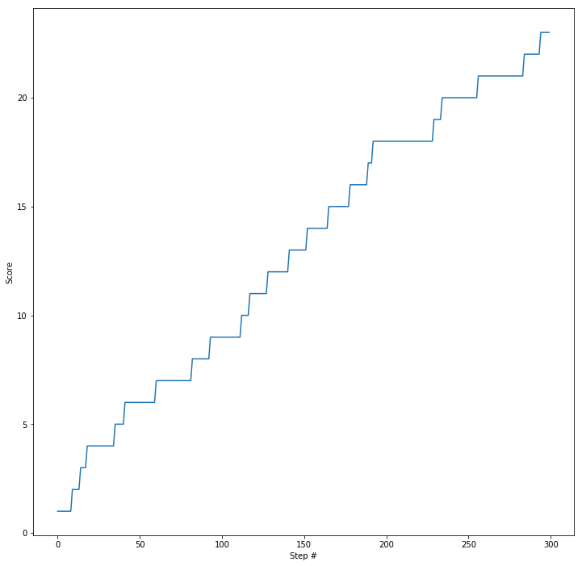

# Project 1: Navigation

## Introduction

A Unity environment was trained to pick up yellow bananas and avoid blue ones.

A reward of +1 is provided for collecting a yellow banana, and a reward of -1 is provided for collecting a blue banana.  

The state space has 37 dimensions and contains the agent's velocity, along with ray-based perception of objects around agent's forward direction.  Given this information, the agent has to learn how to best select actions.  Four discrete actions are available, corresponding to:
- **`0`** - move forward.
- **`1`** - move backward.
- **`2`** - turn left.
- **`3`** - turn right.

The task is episodic, and in order to solve the environment, the agent must get an average score of **+13** over **100** consecutive episodes.

### Getting Started

1. Download the environment from one of the links below.  You need only select the environment that matches your operating system:
    - Linux: [click here](https://s3-us-west-1.amazonaws.com/udacity-drlnd/P1/Banana/Banana_Linux.zip)
    - Mac OSX: [click here](https://s3-us-west-1.amazonaws.com/udacity-drlnd/P1/Banana/Banana.app.zip)
    - Windows (32-bit): [click here](https://s3-us-west-1.amazonaws.com/udacity-drlnd/P1/Banana/Banana_Windows_x86.zip)
    - Windows (64-bit): [click here](https://s3-us-west-1.amazonaws.com/udacity-drlnd/P1/Banana/Banana_Windows_x86_64.zip)
    
    (_For Windows users_) Check out [this link](https://support.microsoft.com/en-us/help/827218/how-to-determine-whether-a-computer-is-running-a-32-bit-version-or-64) if you need help with determining if your computer is running a 32-bit version or 64-bit version of the Windows operating system.

2. Place the file in the DRLND GitHub repository, in the `p1_navigation/` folder, and unzip (or decompress) the file. 

### Instructions

* Follow the instructions in `Navigation.ipynb` to get started with training your own agent.
* You can watch the trained agent with `Navigation Test.ipynb`. Watch it run with `checkpoint_700_1.pth` model loaded.

* `Navigation-Experiments.ipynb` is a sandbox where experiments could be run in order to make a quick decision to "fail fast" if training is not converging fast enough.

### Implementation Details

See [Report.md](Report.md) for details.

* `agent.py` - Agent class and hyper-parameters
* `model.py` - Dueling DQN model implementation (see [paper](https://arxiv.org/pdf/1511.06581.pdf))
* `memory.py` - Prioritized Experience Replay supporting memory (see [paper](https://arxiv.org/pdf/1511.05952.pdf))

## Finished Agent

The trained model has achieved an average score of **35.2** over 100 consecutive episodes. The length of training to achieve this score: **800** episodes.

## Video

For the full 30 seconds of video go [here.](https://youtu.be/WK1zNtVoBFA). The graph below shows rewards accumulated in this episode:
