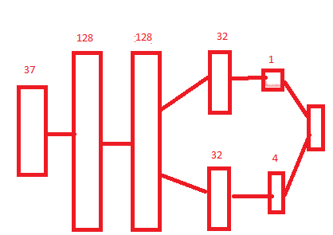
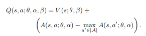
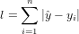
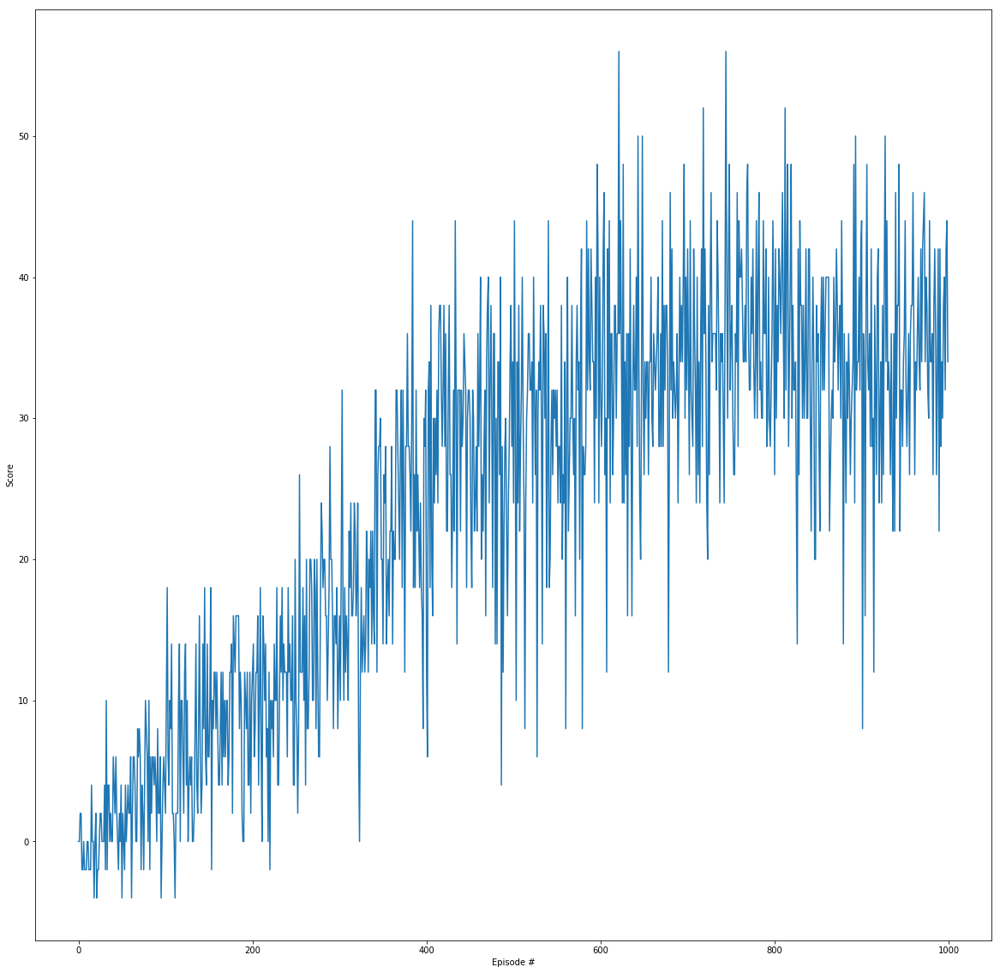

# Navigation Project Report

## Introduction

A [Unity ml-agents](https://github.com/Unity-Technologies/ml-agents) modifed environment was trained to pick up yellow bananas and avoid blue ones.

A reward of +1 is provided for collecting a yellow banana, and a reward of -1 is provided for collecting a blue banana.  

The state space has 37 dimensions and contains the agent's velocity, along with ray-based perception of objects around agent's forward direction.  Given this information, the agent has to learn how to best select actions.  Four discrete actions are available, corresponding to:
- **`0`** - move forward.
- **`1`** - move backward.
- **`2`** - turn left.
- **`3`** - turn right.

The task is episodic, and in order to solve the environment, the agent must get an average score of **+13** over **100** consecutive episodes.

<div style="text-align:center">


</div>

## Solution Architecture

### Neural Net

We implement a [Dueling DQN](https://arxiv.org/pdf/1511.06581.pdf) with [Prioritized Experience Replay](https://arxiv.org/pdf/1511.05952.pdf).

In this solution the code for the [Lunar Lander](../dqn) excercise is used as a basis. We modify the `model.py` file to contain a variation on the Dueling DQN. The origina Dueling DQN architecture assumes convolutional layers before fully connected one. My architecture replaces convolutionsal layers with fully connected due to the nature of the state: we are not dealing with images, just a 37-dimensional vector:

Here is the network architecture, where numbers above layers are output sizes of these layers:
<div style="text-align:center">


</div>

I have chosen to implement equation (8) for the output layer:

<div style="text-align:center">



</div>

Here, of course, &theta; stands for weights common to the shared fully connected layers, not convolutional ones.

### Prioritized Experience Replay

The implementation is in `memory.py`. The `ReplayBuffer` class adds the priorities buffer to the experiences storage, where each priority corresponds to the absolute error observed for a given _(s, a)_ pair in a TD step. The priorities are updated by the agent together with the &beta; parameter for weight bias compensation.

### Agent

The agent code is in `agent.py`. The main method, `learn()` was updated to include prioritized replay as well as frozen Q targets. The latter did not come in useful as it turned out.

One important change for faster convergence was replacing mean squared error with L1: 



This is also indicated in the Priorized Experience Replay paper.

## Experiments

Training was set to run for **1000** episodes, each of the maximul length of **2000** steps (although it appears an episode runs for a maximum of **300** steps).

The agent achieved average rewards of **15** (exceeding the solution criterion) over 100 consecutive episodes at episode 340 (starting at 241). The agent was trained further to collect an average reward of **35.2** at episode 800 (starting at 701).

```
Episode 100	Average Score: 1.880
Episode 200	Average Score: 7.760
Episode 300	Average Score: 12.440
Episode 340	Average Score: 15.000
Environment solved in  240 episodes!	Average Score: 15.000
Episode 400	Average Score: 21.020
Episode 500	Average Score: 27.960
Episode 600	Average Score: 29.920
Episode 700	Average Score: 33.480
Episode 800	Average Score: 35.600
Episode 900	Average Score: 34.480
Episode 1000	Average Score: 34.260
```

<div style="text-align:center">


</div>

After episode 800, the average score started falling.

### Hyperparameters

The following were found optimal:

```python
BUFFER_SIZE = int(1e5)  # replay buffer size
BATCH_SIZE = 64         # minibatch size
GAMMA = 0.99            # discount factor
TAU = 1e-3              # for soft update of target parameters
LR = 5e-4               # learning rate 
UPDATE_EVERY = 4        # how often to update the network
UPDATE_TARGET_STEPS = 1 # update target weights interval
ALPHA = 0.8             # priority exponent for prioritized replacement
BETA = 0.7              # initial beta (annealed to 1) for prioritized replacement
```

Curiously enough, setting `UPDATE_TARGET_STEPS` to anything more than 1 significantly detereorated convergence: both speed and reward amount. This is very strange and needs some more thought. (This parameter regulated how often Q-target was updated from the running Q). Because of this I am not calling it a "double" network. Parameters were updated at every step like in a regular DQN.

While the weights bias-correcting parameter &beta; favored higher initial values there appeared to be performance deterioration towards the end of training as the parameter is linearly annealed to 1. &alpha; parameter also influenced the progression of training, the best combination I could find is shown above.

As mentioned above, L1 error worked very well, definitely much better than L2, in conjunction with the prioritized replay. Weighted priorities in this case played the role of regularization.

`BATCH_SIZE` was found to be optimal at 64 in combination with the network layer sizes shown above. I have experimented with both larger and smaller sizes.

`LR` for Adam optimizer was set at 5e-4, smaller values gave inferior results, I have not experimented with larger values.

### Network Depth

I have experimented with more shallow dueling network. My original implementation did not have the length 32 hidden layers for both value and advantage branches of the network. Adding them improved things significantly. I have not experimented with deeper architecture, my experience with fully connected networks being that anything deeper than 2 layers does not usually help much.

### Baseline Architecture.

My baseline was the DQN from the [Lunar Lander](../dqn) excercise. Amazingly enough, it solves this problem without any modifications to the code, but converges slightly slower and does not achieve a moving average reward on a window of 100 episodes of more than **22** on ~800 episodes total training. Adding duelling architectue moved the score up to **30**, adding prioritized replay and changing the loss function to L1 loss lead to the final result of **35-36**.

The baseline network did appear to be sufficient to satisfy the project requirement, though.

### Future Work

The following can be investigated:
* Degrading learning rate is something easy and necessary to try at the later stages of training.
* Adam hyper-parameters may also need some fine-tuning to see if they help with the network being "stuck" at the later stages
* [Double Q-Network](https://arxiv.org/pdf/1509.06461.pdf). In my experiments (see above) trying to freeze Q targets actually deteriorated perfromance. It would be interesting to see if a Double DQN would help.
* [Noisy Net](https://arxiv.org/pdf/1706.10295.pdf). Experimenting with noise could be interesting.
* [Rainbow](https://arxiv.org/pdf/1710.02298.pdf). Since this implementation is so close to the Rainbow algorithm already, it seems to be a natural extension to what has been developed: just add Noise.