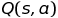
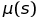
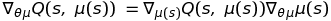
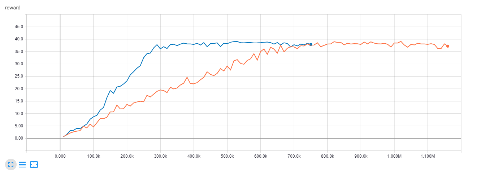
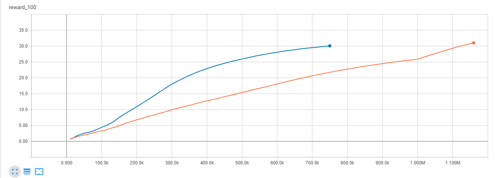
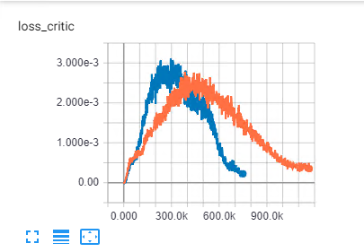
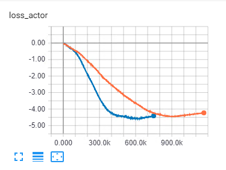
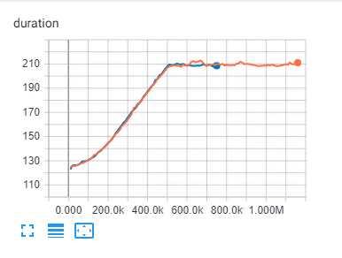

# Solving the Reacher Environment with DDPG

## Learning algorithm

Deep Deterministic Policy Gradient belongs to the Actor Critic class of the policy-based learning algorithms genus, although it would probably be more precise to call it a "Master-Slave" method (after the famous chapter in Phenomenology by G. W. F. Hegel), after all, actor is working hard to maximize critic output.

Just like in the discrete DQN space (or any RL space), we are working to maximize the  funcion. If  is what we use to get our actions, and everything is deterministic, we can substitute  into the value function directly and obtain the gradient by chain rule: . And so we can use a neural net that accepts the output of actor neural net together with the state. The rest is left to back propagation to compute the gradient. And since actor network is working hard to maximize critic output, we simply express it in terms of loss by setting actor loss to negative critic output (thus completing the master-slave relationship).

This also has an advantage of being off policy, so we can gorge ourselves on experience while training and independently of it which should also help.

## Picking the task

I decided to solve the 20 agent environment because it appeared easier to solve than the 1 agent. After all, we are training the same "brain", but the data flows 20 times faster than in the case of a single agent! It appears to me that solving with 1 agent is like choosing a $1 bill when offered a choice between $1 and $20 bills.

## Picking the model

I have experimented with several models, but found the best ones to be what the majority of folks used for training their agents. The one I ended up using also contains a batch normalization layer. There is a difference of opinion as to whether this helps in DRL cases, but it did help in our case.

|    |   |
|---|---|

## Trials & Hyperparameters

Due to my love for new and shiny things, I started out by implementing the [D4PG](https://openreview.net/pdf?id=SyZipzbCb) algorithm (the code can be found in `d4pg_agent.py` in this directory). And to push the boundaries even further, the replay buffer was the Prioritized Experience Replay buffer. As stoked as I was, it failed miserably and was also very expensive to experiment with (extremely slow). I then turned to DDPG and failed as well. Prioritized experience replay did not make any difference, I could not get the moving average reward to climb anywhere higher than 3.

I tried increasing the learning rate for the critic moderately that seemed to give learning a boost initially, but it died down quickly. I despaired and turned to external help, (see References below, based on [Udacity guidelines](https://www.udacity.com/legal/community-guidelines) and the [guidance on avoiding plagiarism](https://udacity.zendesk.com/hc/en-us/articles/360001430552-Guidelines-for-submitting-original-work)).

I did find two crucial things:
1. The agent does not start training until _a lot_ of samples are available. In order to get it _a lot_ of samples it is necessary to spin the environment for quite a few cycles before applying learning. But then learning could also run for a few cycles
2. I should not be shy with learning rate.
Thus I ended up with the following hyperparameters:

```python
BUFFER_SIZE = int(1e6)  # replay buffer size
BATCH_SIZE = 128        # minibatch size
GAMMA = 0.99            # discount factor
TAU = 1e-3              # for soft update of target parameters
LR_ACTOR = 1e-3         # learning rate of the actor
LR_CRITIC = 1e-3        # learning rate of the critic
WEIGHT_DECAY = 0        # L2 weight decay
LEARN_NUM = 10          # number of learning passes
OU_SIGMA = 0.2          # Ornstein-Uhlenbeck noise parameter
OU_THETA = 0.15         # Ornstein-Uhlenbeck noise parameter
EPSILON = 1.0           # explore->exploit noise process added to act step
EPSILON_DECAY = 1e-6    # decay rate for noise process
```

The only ones of interest here are `LR_ACTOR` and `LR_CRITIC`. From my work in vision I know that learning rate can work magic on a solution both ways (make or break), so I was reluctant to change it too much from the original values of `1e-4` (`3e-4` for critic). However this was the second crucial step in this case.

This is when things became to converge very quickly.

## Results

Executed 2 runs. In the first run it took **114** episodes to solve the environment. In the second run it took only **75** episodes to acieve the goal of the average 30+ reward, so I am not clear on why the environment is considered solved in n - 100 episodes. In the first case, it would mean the environment was solved even before training started running.

Graphs below show two different training runs

**Note:** The graphs below are created by TensorBoard. Since TensorBoard "pulses" at every timestamp and each episode consists of 1000 timesteps, where training happens for every 10 timesteps every 20 timesteps, 1 episode = 10 * 1000 **recorded** timesteps. Rewards are collected **once per episode, i.e. once per 10000 timesteps**, losses are collected **once per timestep**

Actor (critic) models for both runs are saved as `checkpoint_actor_run_xx.pth` and `checkpoint_critic_run_xx.ptrh`

### Rewards



### Mean Rewards



### Other Plots

|        Critic Loss      |    Actor Loss (-Q(s, a))  | Episode Duration  |
|-----|---|---|
|   |   |   |

We clearly see:

1. Under the given scheme trained model converges to the maximum reward of 40
2. Duration of each episode depends on the size of the replay buffer. A good source of future performance optimization.

## Lessons Learned

### Using Tensorboard

Tensorboard is an invaluable tool for any ML, I would suggest making it a part of these lessons. It allows to assess the progress of learning quickly, in this case - by looking at `critic_loss` but it is also a rich visualization environment which helps a lot in machine learning.

### Chance Factor

Chance plays a huge role in DRL and this needs to be taken into account. A random seed with which training starts can have drastic effects on it. This is very unfortunate, because it doesn't help when debugging code! I still don't know if my D4PG implementation is essentially buggy or is it just inappropriate for this problem, or maybe needs more hyperparameter tuning.

### Past ML Experience is not Always Useful

... and sometimes actually harmful. As [this great article](https://www.alexirpan.com/2018/02/14/rl-hard.html) mentions, in vision, if we throw a powerful enough convnet at the problem, we'll get something meaningful back. Here it's a wild wild west and so sometimes taking a risk, like increasing the learning rate by an order of magnitude, may be ok.

## Future work

1. Get some clarity on D4PG situation: bugs or suboptimal?
2. Try PPO: some folks have achieved great results with it and they claim it is faster
3. Experimient with different lengths of data collection intervals vs learning intervals (right now collecting data every 20 steps then learning for 10)
4. **Performance tuning** This could really use a perf boost. The solution runs very slow, it underutilizes the GPU (not surprisingly), it slows down significantly as the replay buffer fills up, and since all computations are single-threaded, the multi-core CPU is underutilized as well. Somewhere here a lot of optimization oportunities are burried. Unearthing them would allow greater flexibility for experimentation. As of right now switching to D4PG with Prioritized Experience Replay, even if debugged and working, is not feasible because of the cost. When I was running it and the replay buffer was filling up, episode duration started from 270 sec and reached 1800 sec by episode 45.

## References

* https://github.com/tommytracey/DeepRL-P2-Continuous-Control
* [Deep Reinforcement Learning Hands-On](https://www.amazon.com/dp/B076H9VQH6/ref=dp-kindle-redirect?_encoding=UTF8&btkr=1) by Max Lapan
