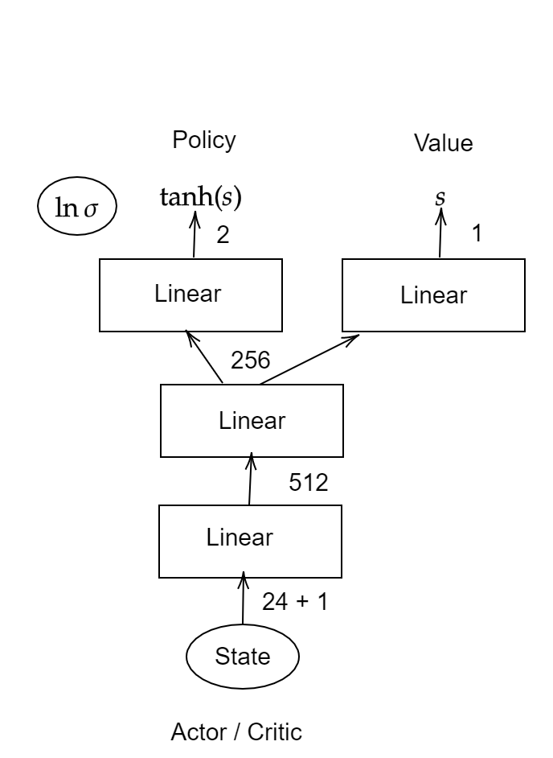
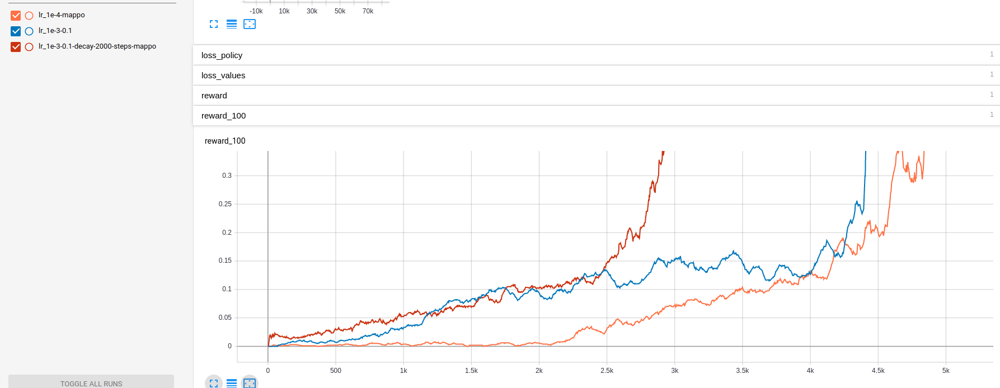
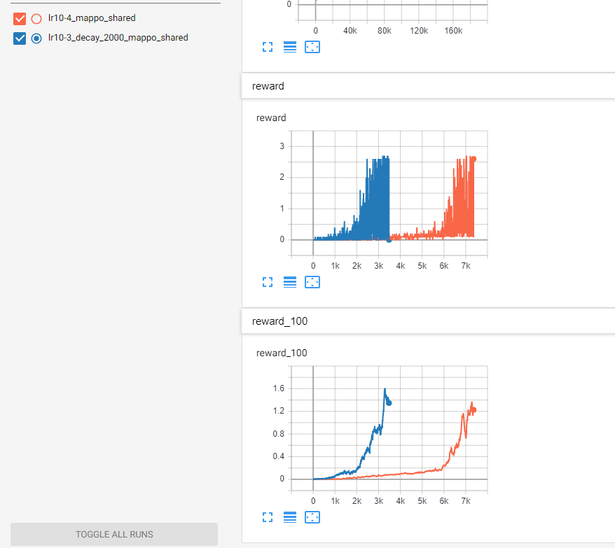
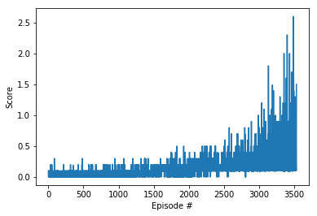

# Solving the Tennis Environment with Shared Parameters PPO

## Learning Algorithm

The algorithm implemented in this solution is described in the paper [Cooperative Multi-Agent Control Using Deep
Reinforcement Learning](http://ala2017.it.nuigalway.ie/papers/ALA2017_Gupta.pdf)

The paper describes a meta-algorithm which can be applied to an existing DRL algorithm of choice to map it to an environment of homogeneous (performing the same type of task) agents. Translated to Unity environments - these are the agents driven by the same brain.

The authors of the paper did not test PPO but the application is straightforward.

## Shared Parameters PPO

In this modified PPO, we maximize a slightly modified surrogate function, expressed in terms of negative loss so we can fit it to any existing machine learning frameworks that do SGD-based type optimitzaions for us:


Here The advantage function is computed as:


The only non-standard thing here is the presence of an extra parameter _m_ in the advantage and policy calculations.

The authors of the above paper offer their "golden mean" solution to the dilemma of entirely centralized (one model is learned to approximate a single policy for all agents) and entirely distributed (one model is learned per agent) policy. 

We learn a single model thus solving scalability problems inherent in the distributed approach, but we introduce a parameter unique to every agent instead of trying to mimic the exact state of an agent that takes into account all other agents, thus solving the exponentially increasing complexity of the state of centralized models.

The parameter _m_ is added to the advantage function and to policy computations. _m_ is the index of a participating agent. In our case _m_ is an integer in [0, 1], since we only have 2 agents.

All the rest of the model parameters are shared between agents.

## Network

In PPO, we learn stochastic policies in a continuous domain by learning parameters of a multivariate normal distribution, the dimensions of which are equal to the dimensions of our action space.

Proposed network:



Here the "critic" network computes the value function which we use to compute advantages (one per agent), and the actor computes the mean and stores the logstd of the Gaussian that we learn. This logstd does not directly depend on the inputs, but it participates in gradient descent through the parameter mechanism available in PyTorch.

This configuration is courtesy of [https://github.com/tnakae/Udacity-DeepRL-p3-collab-compet](https://github.com/tnakae/Udacity-DeepRL-p3-collab-compet) which helped me a lot in my PPO implementation.

## Implementation

Like in the regular PPO, we collect the trajectories for `TMAX` steps, across episodes if necessary, and then stamp agent id on each state vector. Thus dimensionality of the state increases by 1. This way, the model always "knows" which agent's policy is being approximated. 

We then train on `BATCH_SIZE` of trajectory pieces for a number of `EPOCHS`

Agent identity participates in advantage computation during advantage normalization step, where each advantage is normalized based on mean and standard deviation of the agent for which it is computed.

During the test phase, the `act` function of the agent receives agent's index together with the state for action computations. Actions are sampled from the distribution learned during training.

## Experiments

The [notebook](Tennis.ipynb) allows for training/testing the agent, it is also possible to debug the implementation by running `python driver.py` in `PPO_1` directory. Tensorboard was used for hyper-parameter tuning:

```python
LR = 1e-03              # learing rate
EPSILON = 0.1           # action clipping param: [1-EPSILON, 1+EPSILON]
BETA = 0.01             # regularization parameter for entropy term
EPOCHS = 20              # train for this number of epochs at a time
TMAX = 1024              # maximum trajectory length
AVG_WIN = 100           # moving average over...
SEED = 12                # leave everything to chance
BATCH_SIZE = 128         # number of tgajectories to collect for learning
SOLVED_SCORE = 0.5      # score at which we are done (double the required)
STEP_DECAY = 2000       # when to decay learning rate
GAMMA = 0.99            # discount factor
GAE_LAMBDA = 0.96       # lambda-factor in the advantage estimator for PPO

```
Here `LR` is initially set to `1e-03` but degraded to `1e-04` after 2000 episodes. The chart below shows the effects of this learning rate handling of speed of convergence. I tried other variations but this was the best I saw.



In terms of highest rewards achieved fast, the maximum was `2.7`, this is the policy used in the animation for the [README](Readme.md) for this project. It results in a very boring game where nobody loses ever, or barely ever.



## Reproduceability

Worth noting, that I was not using the `SEED` parameter, even though I tried to for reproduceability. Unfortunately things did not converge at all or very slowly. I tried about half a dozen of different seeds, naturally it's a bit fewer than the number of seeds available, but blindly searching for chance is too time consuming a process as all buyers of lottery tickets no doubt know.

Luckily, we did achieve consistent reproduceability without explicitly seeding any random generators, though.

## Rewards Graph

From the [notebook](Tennis.ipynb):



This environment was solved in `3432` episodes.

## For the Future

* The PPO algorithm is *very fast* (mainly because we don't maintain the replay buffer of any kind) which makes it ideal for trying things. In that sense it's a good way to improve performance of training, for which we were concerned in the previous project. However, folks seemed to have a lot of success with MADDPG, so it would be interesting to try that.

* I did not experiment with trajectory sizes and the number of epochs, although reducing the batch size did seem to negatively impact performance. There is never enough hyperparameter tuning!

* The environment was quite simple, so the shared parameters algorithm was probably a bit of an overkill for it. It would be great to try it on more complex environments, like Soccer where 4 agents of 2 agent classes are involved.

* A project to consider after this course is done, is training an agent with a shared parameters algorithm on a platform game written from scratch, with agent-player playing against agent-monsters.

## References

* [Cooperative Multi-Agent Control Using Deep
Reinforcement Learning](http://ala2017.it.nuigalway.ie/papers/ALA2017_Gupta.pdf)
* [Deep Reinforcement Learning Hands-On](https://www.amazon.com/dp/B076H9VQH6/ref=dp-kindle-redirect?_encoding=UTF8&btkr=1) by Max Lapan
* [https://github.com/tnakae/Udacity-DeepRL-p3-collab-compet](https://github.com/tnakae/Udacity-DeepRL-p3-collab-compet)

